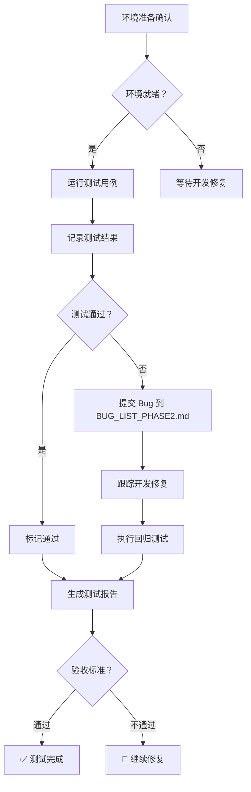

# 📋 Phase 2 测试环境准备状态

**创建日期：** 2026-03-14 10:23  
**测试经理：** AI 团队  
**优先级：** 🔴 P0（准备就绪，等待开发修复后执行）

---

## 环境准备清单

### ✅ 已完成项

| 项目 | 状态 | 说明 | 验证时间 |
|------|------|------|----------|
| 测试用例文档 | ✅ 就绪 | `PHASE2_TEST_CASES.md` (37 个用例) | 2026-03-13 |
| 测试报告模板 | ✅ 就绪 | `PHASE2_TEST_REPORT.md` | 2026-03-13 |
| Bug 跟踪模板 | ✅ 就绪 | `BUG_LIST_PHASE2.md` (已创建) | 2026-03-14 |
| 测试脚本 | ✅ 就绪 | `tests/product-research.test.ts` | 2026-03-14 |
| 测试环境配置 | ✅ 就绪 | `.env.test` | 2026-03-14 |

### ⏳ 待完成项

| 项目 | 状态 | 负责人 | 预计完成 |
|------|------|--------|----------|
| 测试数据库启动 | ⏳ 等待中 | 开发团队 | - |
| 测试数据准备 | ⏳ 等待中 | 开发团队 | - |
| 应用服务启动 | ⏳ 等待中 | 开发团队 | - |
| 开发修复完成 | ⏳ 等待中 | 开发团队 | - |

---

## 测试环境配置

### 环境信息

```yaml
测试环境：
  应用地址：http://localhost:3001
  数据库：localhost:5432
  数据库名：trade_erp
  用户：trade_erp
  环境：test
```

### 测试工具

- **测试框架：** Jest
- **测试脚本位置：** `/Users/apple/clawd/trade-erp/tests/`
- **产品调研测试：** `product-research.test.ts` (24,971 bytes)

### 测试数据

- **种子数据脚本：** `scripts/seed-v0.4.js`
- **测试数据准备：** `tests/prepare-test-data.js`

---

## 测试执行计划

### Day 1 (03-17) - 产品录入与属性模板测试

| 时间 | 任务 | 用例数 | 负责人 |
|------|------|--------|--------|
| 09:00-12:00 | 产品录入测试 | 20 个 | AI 团队 |
| 13:00-15:00 | 属性模板管理测试 | 15 个 | AI 团队 |
| 15:00-18:00 | Bug 记录与跟踪 | - | AI 团队 |

**测试模块：**
1. 品类管理（TC-001 ~ TC-004）
2. 属性模板管理（TC-010 ~ TC-012）
3. 产品列表（TC-020 ~ TC-025）
4. 产品详情（TC-030 ~ TC-032）

### Day 2 (03-18) - 产品对比与集成测试

| 时间 | 任务 | 用例数 | 负责人 |
|------|------|--------|--------|
| 09:00-12:00 | 产品对比测试 | 25 个 | AI 团队 |
| 13:00-15:00 | 集成测试 | 10 个 | AI 团队 |
| 15:00-17:00 | 回归测试 | - | AI 团队 |
| 17:00-18:00 | 生成测试报告 | - | AI 团队 |

**测试模块：**
1. 产品对比（TC-040 ~ TC-044）
2. 数据导入导出（TC-050 ~ TC-055）
3. 数据看板（TC-060 ~ TC-064）
4. API 测试（API-001 ~ API-005）
5. 性能测试（PERF-001 ~ PERF-003）

---

## 测试执行流程



---

## 验收标准

根据 Phase 2 测试计划，发布标准：

| 标准 | 目标 | 当前状态 |
|------|------|----------|
| 测试覆盖率 | > 85% | ⏳ 待测试 |
| P0 Bug 数量 | 0 | ✅ 0 (当前) |
| P1 Bug 数量 | < 5 | ✅ 0 (当前) |
| 所有用例通过 | 是 | ⏳ 待测试 |

---

## 输出文档

测试完成后将生成以下文档：

1. **`PHASE2_TEST_REPORT.md`** - 详细测试结果报告
   - 测试执行摘要
   - 用例通过率统计
   - 模块质量评估
   - 发布建议

2. **`BUG_LIST_PHASE2.md`** - Bug 跟踪列表
   - Bug 详细描述
   - 严重程度分类
   - 修复状态跟踪
   - 验证记录

3. **测试覆盖率报告**
   - 功能覆盖率
   - API 覆盖率
   - 性能测试结果
   - 浏览器兼容性测试

---

## 当前状态

### 🟡 准备就绪

**已完成：**
- ✅ 测试用例文档就绪（37 个用例）
- ✅ 测试报告模板就绪
- ✅ Bug 跟踪模板就绪（已创建 BUG_LIST_PHASE2.md）
- ✅ 测试脚本就绪
- ✅ 测试环境配置就绪

**等待中：**
- ⏳ 测试数据库启动
- ⏳ 测试数据准备
- ⏳ 应用服务启动
- ⏳ 开发修复完成通知

**下一步行动：**
1. 等待开发团队完成修复
2. 收到通知后启动测试数据库
3. 部署测试环境到 localhost:3001
4. 导入测试数据
5. 开始执行 Phase 2 测试用例

---

## 联系人

- **测试经理：** AI 团队
- **开发负责人：** 待确认
- **测试时间：** 2026-03-17 ~ 2026-03-18

---

## 快速启动命令（等待环境就绪后执行）

```bash
# 1. 启动数据库（如使用 OrbStack PostgreSQL）
# 请开发团队确认数据库已启动

# 2. 启动测试环境
cd /Users/apple/clawd/trade-erp
PORT=3001 npm run dev

# 3. 运行自动化测试
npm test -- tests/product-research.test.ts

# 4. 运行所有测试
npm test

# 5. 生成测试覆盖率报告
npm run test:coverage
```

---

*最后更新：2026-03-14 10:23*  
*状态：🟡 准备就绪，等待开发修复完成*
