# Trade ERP v0.8.0 - 交互流程设计（更新版）

## 目录
- [设计原则](#设计原则)
- [注册登录流程（含审批）](#注册登录流程含审批)
- [审批通用流程](#审批通用流程)
  - [采购申请审批](#采购申请审批)
  - [价格审批](#价格审批)
  - [订单审批](#订单审批)
  - [付款申请审批](#付款申请审批)
  - [费用报销审批](#费用报销审批)
- [多平台订单管理流程](#多平台订单管理流程)
- [海外仓管理流程](#海外仓管理流程)
- [财务管理流程](#财务管理流程)
- [交互设计规范](#交互设计规范)
- [用户体验优化点](#用户体验优化点)

---

## 设计原则

1. **最少点击**：常用操作不超过 3 步
2. **即时反馈**：任何操作都有视觉反馈
3. **防错设计**：危险操作二次确认
4. **可撤销**：支持撤销（删除前确认，删除后可恢复）
5. **一致性**：相同操作逻辑一致
6. **上下文保持**：操作后返回原位置，保持筛选状态

---

## 注册登录流程（含审批）

### 流程图

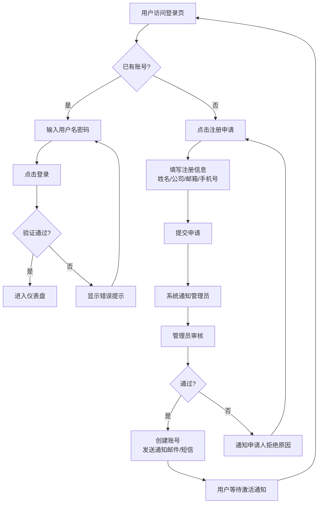

### 交互细节

#### 登录页交互
- **输入校验**：失去焦点即时校验格式
- **密码可见切换**：👁️ 按钮点击显示/隐藏密码
- **记住登录**：勾选后 7 天内免登录
- **错误提示**：具体提示「用户名不存在」or「密码错误」，不笼统说「用户名或密码错误」
- **忘记密码**：发送重置链接到邮箱

#### 注册申请交互
- **表单校验**：每一项即时校验
  - 邮箱格式检查
  - 密码长度 ≥ 8 位
  - 必填项检查
- **提交成功**：清晰提示「申请已提交，等待管理员审核」
- **进度查询**：可查看审核进度

#### 管理员审批交互
- **通知方式**：系统消息 + 邮件通知
- **审批入口**：仪表盘审批待办卡片直达
- **操作**：通过 / 拒绝，拒绝必须填写原因

---

## 审批通用流程

### 审批类型
1. 采购申请审批
2. 价格调整审批
3. 大订单审批
4. 付款申请审批
5. 费用报销审批

### 通用审批流程

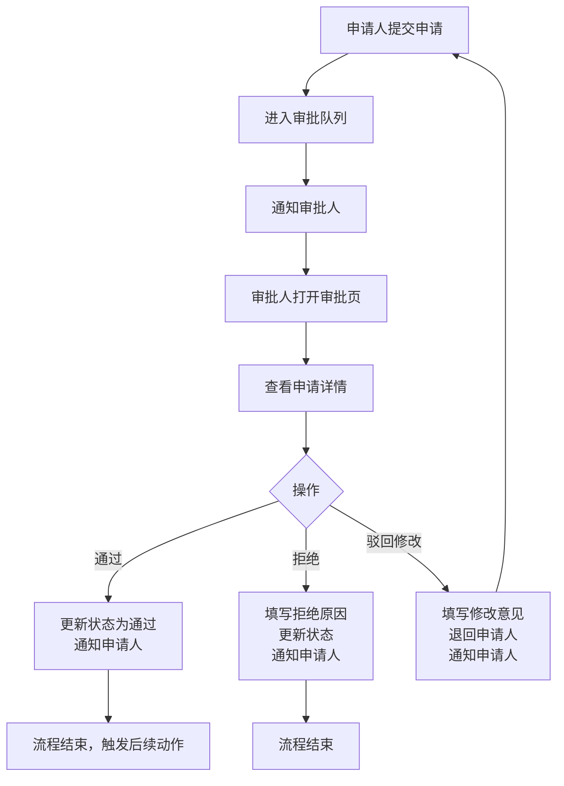

### 多级审批规则
- **小额**：一级审批（部门经理）
- **中额**：二级审批（部门经理 → 财务 → 老板）
- **大额**：三级审批（部门经理 → 财务 → 老板）
- **配置化**：不同公司可配置审批阈值

---

## 采购申请审批

### 业务流程

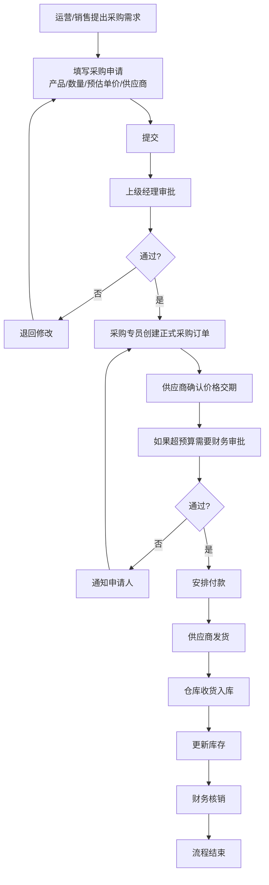

### 交互要点
- **采购申请单**：支持添加多个产品行
- **预算对比**：自动显示剩余预算，超预算红色提醒
- **附件**：支持上传报价单、沟通截图等
- **审批意见**：审批人可留备注
- **状态追踪**：申请人可在列表看到当前审批节点

---

## 价格审批

### 业务流程

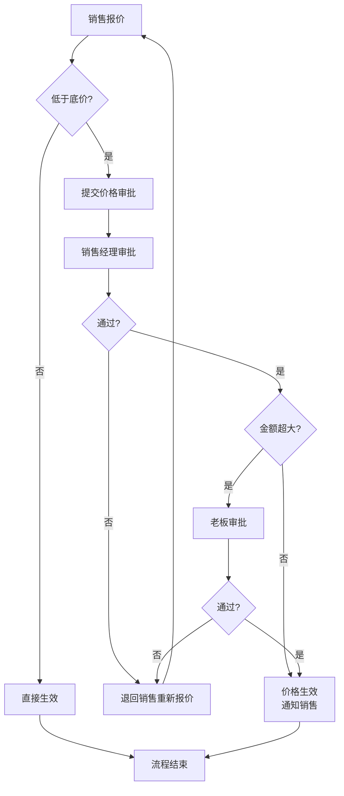

### 交互要点
- **自动判断**：系统自动判断是否低于底价，自动触发审批
- **底价显示**：仅管理者可见底价，销售只知是否需要审批
- **利润预览**：审批时显示预计利润

---

## 订单审批

### 业务流程

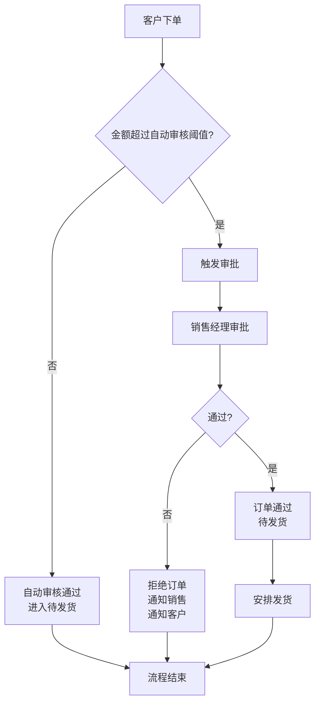

### 交互要点
- **阈值可配置**：不同公司设置不同自动审核阈值
- **快速查看**：审批页显示客户信息、商品明细、金额汇总
- **一键通过/拒绝**：操作简单

---

## 付款申请审批

### 业务流程

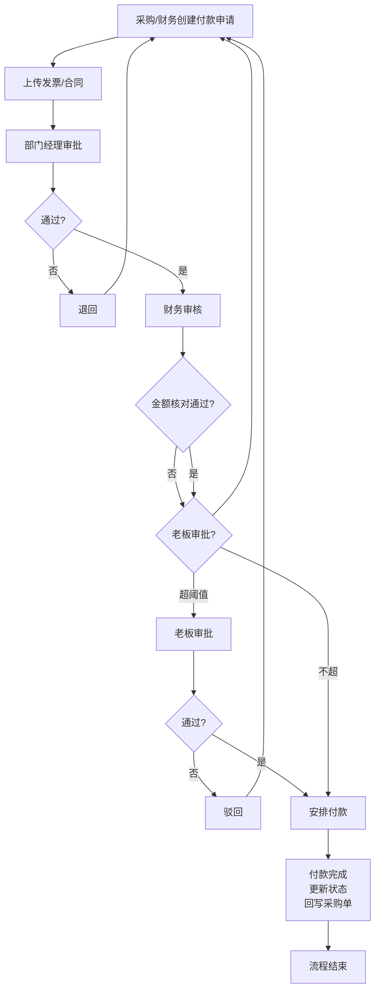

### 交互要点
- **关联采购单**：付款申请必须关联采购单，可追溯
- **发票校验**：支持上传发票 PDF/图片
- **对账**：财务审批时显示供应商往来对账

---

## 费用报销审批

### 业务流程

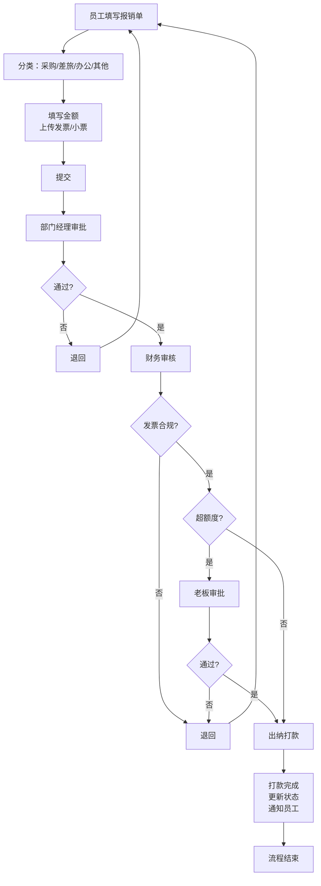

### 交互要点
- **报销分类**：预设分类，便于统计
- **OCR识别**：支持拍照识别发票金额（后续迭代）
- **额度控制**：根据职位自动计算可报销额度
- **进度通知**：每一步节点都通知申请人

---

## 多平台订单管理流程

### 整体流程

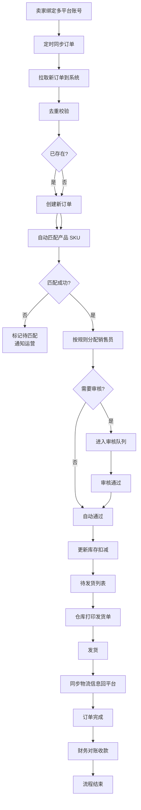

### 交互要点

#### 订单同步
- **手动同步**：随时点击「同步订单」按钮立即拉取
- **自动同步**：每 15 分钟自动拉取
- **同步日志**：查看同步记录，失败显示原因
- **批量操作**：支持批量标记已同步

#### SKU 匹配
- **智能匹配**：按 SKU 编码自动匹配
- **手动匹配**：运营手动绑定，系统记忆下次自动匹配
- **批量匹配**：支持批量操作

#### 发货处理
- **批量打单**：选中多个订单批量打印发货单
- **一键同步物流**：填写快递单号后自动同步回原平台
- **批量发货**：支持批量操作

### 异常处理
- **平台同步失败**：系统重试 3 次，仍失败通知管理员
- **库存不足**：自动标记，高亮提醒，锁定订单待处理
- **价格异常**：价格远低于平均，提醒运营审核

---

## 海外仓管理流程

### 库存调拨流程

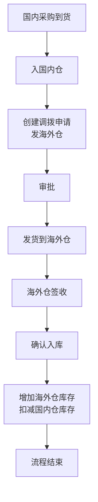

### 海外仓发货流程

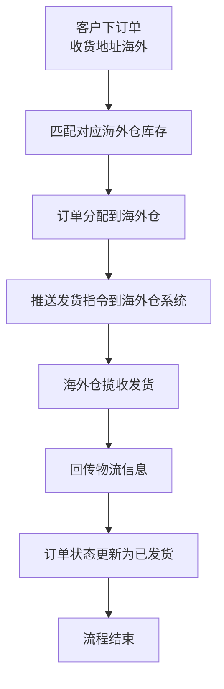

### 库存盘点流程

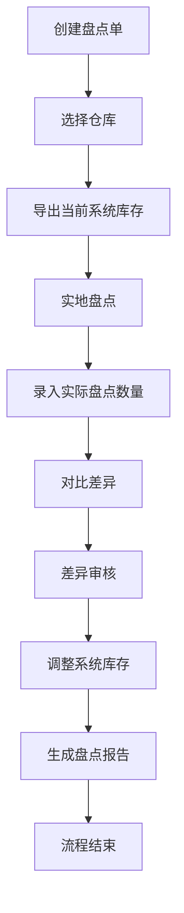

### 交互要点
- **多仓库视图**：左侧切换仓库，显示各仓库库存
- **调拨跟踪**：跟踪调拨物流状态
- **库存成本**：分仓库计算成本
- **预警**：海外仓低库存自动提醒补货

---

## 财务管理流程

### 收款流程

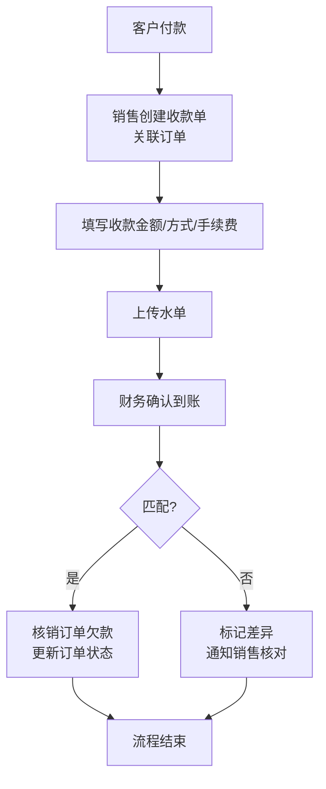

### 付款流程

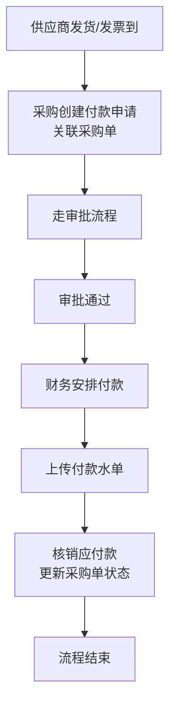

### 利润核算流程

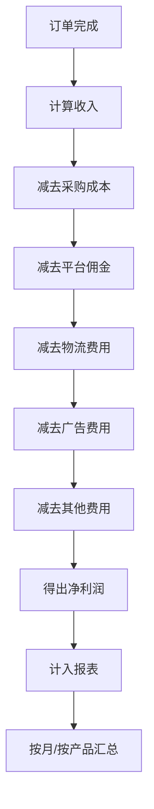

### 交互要点
- **自动关联**：收款单自动匹配订单，减少手动输入
- **对账单**：每月自动生成供应商/客户对账单
- **币种转换**：支持多币种，自动换算本位币
- **报表导出**：利润表可导出 Excel

---

## 交互设计规范

### 按钮点击反馈
- **即时视觉反馈**：按下颜色加深，涟漪效果
- **加载状态**：提交后按钮变为 loading 状态，防止重复点击
- **成功反馈**：操作成功绿色 toast 提示
- **失败反馈**：失败红色 toast 提示，带错误原因

### 表格行交互
- **hover 高亮**：鼠标悬浮行背景变色
- **点击选中**：选中行背景高亮
- **批量勾选**：表头全选/反选
- **右键菜单**：支持右键快捷操作（桌面端）

### 表单交互
- **即时校验**：离开输入框即时校验，不等到提交
- **错误提示**：红色文字在输入框下方，不遮挡
- **自动聚焦**：打开弹窗/页面自动聚焦第一个输入框
- **回车提交**：表单支持回车提交

### 分页交互
- **记住页码**：返回列表页保持之前的页码和筛选
- **跳转输入**：支持直接输入页码跳转
- **每页条数**：支持选择 10/20/50/100 条

### 筛选搜索
- **记住筛选**：返回列表保持筛选条件
- **清除筛选**：一键清除所有筛选
- **实时搜索**：输入即时过滤（本地数据）
- **搜索快捷键**：按 `/` 聚焦搜索框

---

## 用户体验优化点

### 1. 常用操作快捷方式
- **仪表盘快捷入口**：按角色展示常用操作，点击直达
- **右键菜单**：桌面端表格行右键快速操作
- **快捷键**：支持键盘快捷键导航

### 2. 减少重复输入
- **自动填充**：创建订单/客户时智能填充已知信息
- **复制新增**：支持复制已有单据再修改，快速创建
- **模板保存**：常用表单保存为模板，下次直接用

### 3. 消息通知
- **待办汇总**：仪表盘显示各类型待办数量，点击直达
- **实时通知**：新审批、新订单来即时弹窗提醒
- **邮件通知**：重要节点邮件抄送相关人

### 4. 移动端优化
- **触摸友好**：按钮 ≥ 44px，间距足够
- **手势支持**：滑动关闭抽屉，下拉刷新列表
- **拍照上传**：支持直接拍照上传发票/水单

### 5. 错误恢复
- **草稿自动保存**：表单填写中自动保存草稿，刷新不丢失
- **删除确认**：删除操作二次确认
- **回收站**：删除后支持恢复一段时间

### 6. 性能体验
- **懒加载**：列表滚动加载更多，不一次性加载全部
- **骨架屏**：加载中显示骨架屏，减少感知等待
- **缓存**：已加载数据本地缓存，二次打开更快

---

## 版本更新记录

| 版本 | 更新日期 | 更新内容 |
|------|----------|----------|
| v0.7.0 | 2026-03-20 | 初始流程设计 |
| v0.8.0 | 2026-03-25 | 补充完整 5 大类流程，增加交互设计规范和 UX 优化点 |

---

*文档创建：UI/UX Designer · 2026-03-25*
