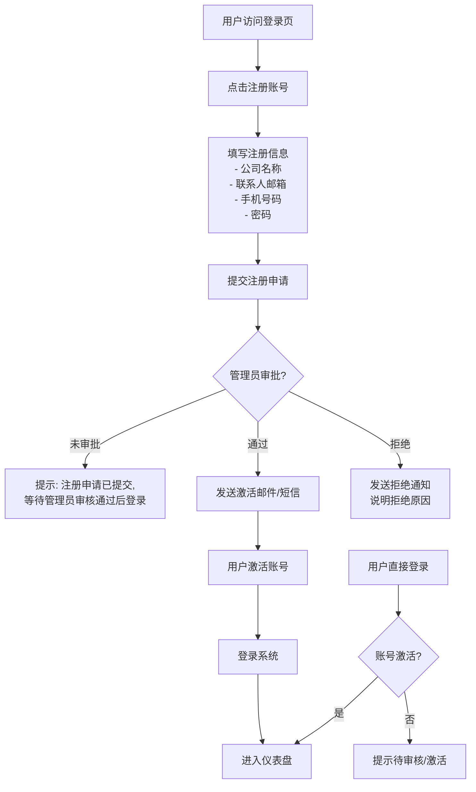
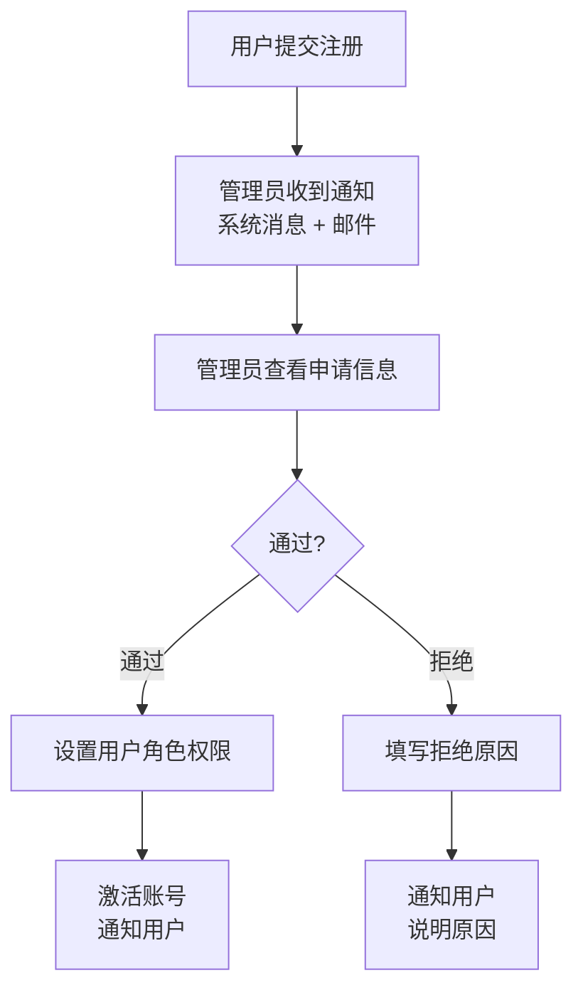
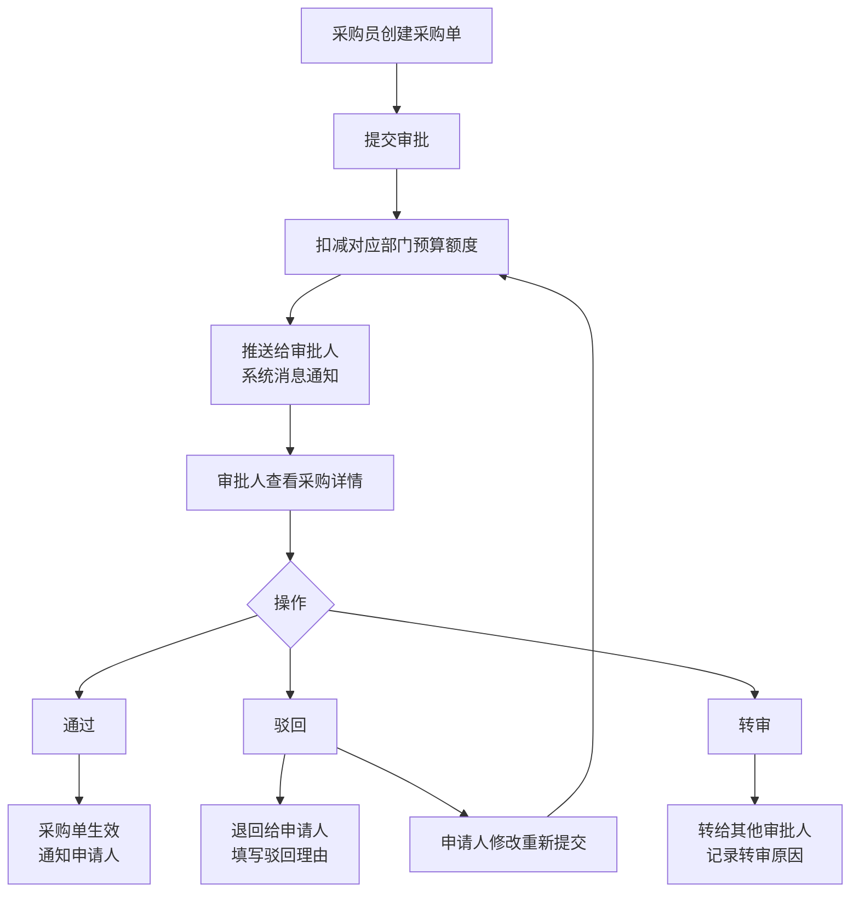
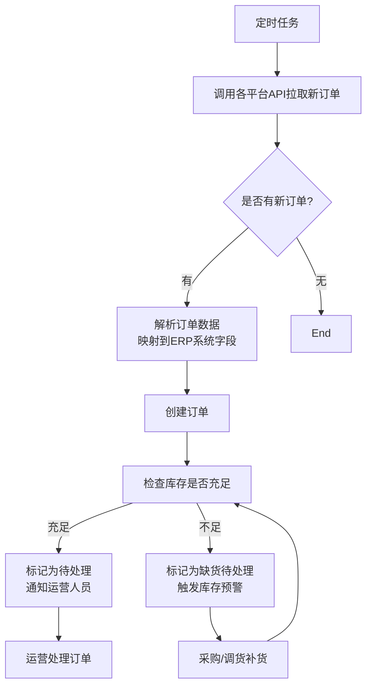
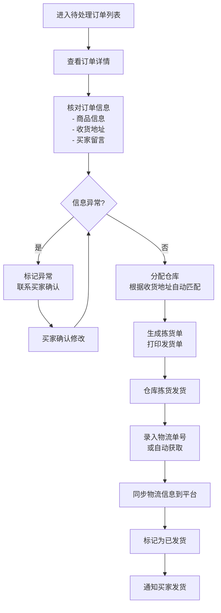
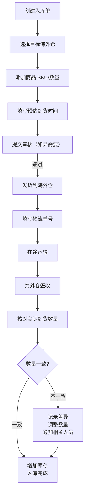
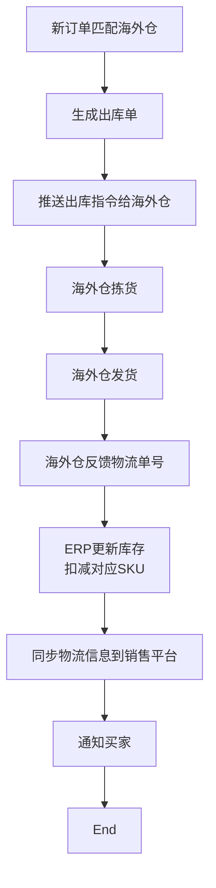
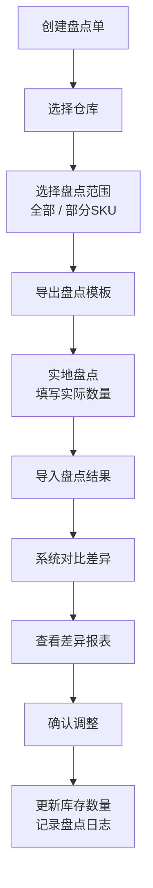

# Trade ERP v0.8.0 - 交互流程设计

## 目录

- [1. 注册登录流程（含审批）](#1-注册登录流程含审批)
- [2. 审批流程交互](#2-审批流程交互)
- [3. 多平台订单管理流程](#3-多平台订单管理流程)
- [4. 海外仓管理流程](#4-海外仓管理流程)
- [5. 通用交互规范](#5-通用交互规范)

---

## 1. 注册登录流程（含审批）

### 流程图

### 交互细节

**注册页面：**
- 实时表单验证
  - 邮箱格式不正确 → 即时提示
  - 密码长度 < 8 → 即时提示
  - 确认密码不一致 → 即时提示
- 同意用户协议勾选框 → 默认不勾选
- 注册成功 → 清晰提示等待审核

**登录页面：**
- 支持邮箱 + 密码登录
- 记住登录 → 7 天免登录
- 忘记密码 → 发送重置链接到邮箱
- 登录失败 → 明确错误原因（密码错/账号未审核/账号被禁用）
- 多终端登录冲突 → 提示是否挤下线

**权限控制：**
- 未激活用户 → 只能访问登录/注册页
- 已激活用户 → 根据角色权限显示对应菜单

---

## 2. 审批流程交互

### 2.1 账号注册审批流程

### 2.2 采购审批流程

### 交互细节

**待办审批入口：**
- 仪表盘审批待办卡片显示数量
- 顶部导航栏消息铃铛显示红点计数
- 点击直接进入审批列表

**审批详情页：**
- 顶部显示审批单基本信息（申请人、时间、金额）
- 中间显示申请内容详情（采购商品明细、备注）
- 底部固定操作栏：通过 / 驳回 / 转审
- 审批意见输入框，支持选填审批意见

**审批状态标记：**
- 🟡 待审批 → 黄色标记
- 🟢 已通过 → 绿色标记
- 🔴 已驳回 → 红色标记
- 🟣 已转审 → 紫色标记

**通知机制：**
- 系统即时推送消息
- 支持邮件/短信通知（可配置）
- 已读/未读状态区分

---

## 3. 多平台订单管理流程

### 3.1 订单自动同步流程

### 3.2 人工处理订单流程

### 交互细节

**订单列表页：**
- 支持多条件筛选（平台、时间、状态、金额区间）
- 支持关键词搜索（订单号、买家姓名、SKU）
- 批量操作：批量发货、批量导出、批量标记
- 异常订单高亮显示（红色边框）

**订单详情页：**
- 订单基本信息卡片（顶部）
  - 订单号、平台、下单时间、买家信息
- 商品明细表格
  - SKU、商品名称、数量、单价、小计
- 物流信息区域
  - 仓库、物流渠道、运单号
- 订单轨迹时间轴
  - 各个状态变更时间点记录
- 底部操作栏
  - 根据当前状态显示可用操作（处理、发货、标记异常等）

**批量处理交互：**
1. 勾选多个订单 → 点击批量发货
2. 导入CSV运单号 → 系统匹配对应订单
3. 预览匹配结果 → 确认提交
4. 批量同步到平台 → 显示处理结果报告

---

## 4. 海外仓管理流程

### 4.1 入库流程（补货）

### 4.2 出库流程（订单发货）

### 4.3 库存盘点流程

### 交互细节

**海外仓库存总览页：**
- 按仓库分组显示卡片
- 每个卡片显示：SKU总数、总库存金额、预警SKU数量
- 点击卡片进入该仓库明细
- 库存预警SKU排在列表最前面，红色高亮

**入库单详情：**
- 状态时间轴（创建 → 在途 → 签收 → 完成）
- 商品明细表格（计划数量 vs 实际到货数量）
- 差异自动计算，红色显示
- 支持上传附件（物流单、箱单）

**操作反馈：**
- 创建成功 → 跳转列表并提示"入库单创建成功"
- 库存更新 → 实时更新库存卡片数字
- 差异处理 → 需要确认才能调整，防止误操作

---

## 5. 通用交互规范

### 5.1 表单交互

**即时验证：**
- 离开输入框即时验证
- 错误信息显示在输入框下方，红色
- 成功不提示，节省空间

**必填项标记：**
- 标签前加红色星号 `*`
- 不填写无法提交

**长表单处理：**
- 分步骤表单，显示进度条
- 每一步可以上一步/下一步
- 支持暂存草稿

### 5.2 表格交互

**排序：**
- 点击表头排序（升序/降序切换）
- 当前排序列显示箭头图标

**筛选：**
- 每列可独立筛选（下拉多选）
- 已筛选列显示漏斗图标标记
- 支持清除单个筛选 / 清除全部筛选

**分页：**
- 默认每页 20 条
- 可选：10/20/50/100 条
- 显示总记录数

**行选中：**
- 点击行任意位置选中
- 支持 Shift 批量选中
- 选中行背景高亮

### 5.3 模态框 vs 页面跳转

| 场景 | 使用 | 原因 |
|------|------|------|
| 新建/编辑简单表单 | 模态框 | 不离开当前页，上下文保持 |
| 新建/编辑复杂表单 | 新页面 | 有更多空间，操作更清晰 |
| 查看详情 | 侧滑抽屉/模态框 | 快速查看，快速返回 |
| 批量操作 | 当前页弹窗 | 保持批量选择上下文 |

### 5.4 加载状态

- 表格数据加载 → 显示骨架屏
- 按钮点击提交 → 按钮置灰 + loading 旋转图标
- 图片加载 → 显示占位图 + 渐变加载动画

### 5.5 操作反馈

**成功操作：**
- 右上角弹出绿色 Toast `✓ 操作成功`，3 秒后消失

**失败操作：**
- 弹出红色 Toast `✗ 操作失败：具体原因`，需要手动关闭

**危险操作：**
- 删除、批量清除等操作 → 二次确认弹窗
- 确认按钮红色，提示文字明确说明影响

### 5.6 快捷键支持（桌面端）

| 快捷键 | 功能 |
|--------|------|
| `Ctrl + K` | 全局搜索 |
| `Ctrl + S` | 保存表单 |
| `Esc` | 关闭弹窗/返回 |
| `Enter` | 提交表单 |

### 5.7 移动端手势

| 手势 | 功能 |
|------|------|
| 下拉刷新 | 刷新列表数据 |
| 左滑行项目 | 显示操作按钮（编辑/删除） |
| 侧滑返回 | 从左边缘右滑返回上一页 |

---

## 用户体验优化要点

1. **减少点击** - 常用操作一步到达，减少跳转
2. **预填数据** - 根据上下文自动推断填写内容
3. **及时反馈** - 任何操作都有即时视觉反馈
4. **防错设计** - 危险操作二次确认，支持撤销
5. **离线操作** - 草稿自动保存，网络恢复后可提交
6. **搜索优先** - 全局快捷搜索，快速定位到任何功能
7. **最近访问** - 记录最近浏览的订单/商品，快速返回

---

## 流程设计原则

- **符合业务实际** - 基于真实跨境电商业务流程设计
- **灵活性** - 支持不同公司审批流程配置
- **可追溯** - 所有关键操作都有日志记录
- **自动化优先** - 尽量系统自动处理，减少人工干预
- **异常可见** - 异常情况突出显示，不淹没在正常数据中
