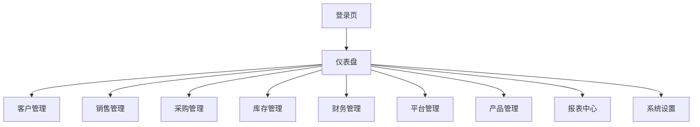
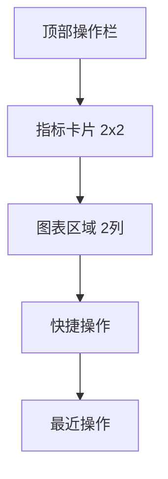

# Trade ERP v0.8.0 - 线框图设计（更新版）

## 目录
- [设计概述](#设计概述)
- [响应式断点](#响应式断点)
- [登录页面](#登录页面)
- [仪表盘首页](#仪表盘首页)
- [客户列表页面](#客户列表页面)
- [订单列表页面](#订单列表页面)
- [库存管理页面](#库存管理页面)
- [表单设计规范](#表单设计规范)
- [表格设计规范](#表格设计规范)
- [模态框设计](#模态框设计)
- [移动端适配](#移动端适配)

---

## 设计概述

### 设计原则
1. **信息分层**：重要信息优先展示
2. **操作高效**：常用操作一键可达
3. **视觉清晰**：留白合理，对比明显
4. **一致性**：组件样式统一规范
5. **响应式**：完美适配三端

### 设计系统
- **主色**：`#2563eb`（专业蓝）
- **辅助色**：`#10b981` 成功绿，`#ef4444` 错误红，`#f59e0b` 警告黄
- **中性色**：基于 Tailwind 灰阶系统
- **字体**：系统无衬线字体族 (Inter → San Francisco → Segoe UI)
- **圆角**：小圆角 6px，中等圆角 8px，大圆角 12px
- **阴影**：三层阴影系统 (浮起、卡片、弹窗)

---

## 响应式断点

| 设备 | 分辨率 | 断点 | 布局方式 |
|------|--------|------|----------|
| 桌面端 | 1920×1080 | ≥1200px | 左侧导航 + 主内容，导航展开 220px |
| 平板端 | 768×1024 | 768-1199px | 左侧默认折叠 64px，点击展开浮层 |
| 移动端 | 375×667 | <768px | 导航抽屉，内容通栏，表格横向滚动 |

### 自适应规则
1. **桌面端 (>1200px)**
   - 侧边栏固定展开，支持折叠
   - 内容区容器最大宽度 1400px，水平居中
   - 多列布局，卡片网格自动填充

2. **平板端 (768-1199px)**
   - 侧边栏默认折叠为图标模式
   - 鼠标悬浮或点击展开
   - 卡片网格 2 列布局
   - 表格压缩列宽

3. **移动端 (<768px)**
   - 侧边栏隐藏，汉堡按钮触发抽屉
   - 卡片通栏堆叠布局
   - 表格横向滚动，保留关键字段
   - 操作按钮放大，适合触摸

---

## 登录页面

### 桌面端布局 (1920)

```
┌─────────────────────────────────────────────────────────────┐
│                    背景图：跨境电商物流主题                   │
│                     ┌─────────────────────┐                  │
│                     │     LOGO 品牌       │                  │
│                     │                     │                  │
│                     │   用户名 [.......]  │                  │
│                     │   密码   [.......]  │                  │
│                     │                     │                  │
│                     │  [ ] 记住登录状态   │                  │
│                     │                     │                  │
│                     │   [登录系统按钮]    │                  │
│                     │                     │                  │
│                     │  忘记密码 | 注册申请 │                  │
│                     └─────────────────────┘                  │
└─────────────────────────────────────────────────────────────┘
```

### 设计要素
- **左侧**：品牌宣传图（可配置）
- **右侧/居中**：登录卡片（白色背景，阴影）
- **登录方式**：用户名+密码，后续支持短信验证码、SSO
- **记住登录**：7 天免登录
- **安全提示**：不建议在公共电脑勾选

### 移动端布局
- 背景图弱化
- 登录卡片通栏，上下留白
- 输入框高度增加到 48px 适合触摸
- 按钮铺满宽度

---

## 仪表盘首页

### 桌面端布局结构

```
┌──────┐ ┌──────────────────────────────────────────────────┐
│ 导   │ │ 面包屑：首页                                      │
│ 航   │ ├──────────────────────────────────────────────────┤
│ 栏   │ │ ┌────────┐ ┌────────┐ ┌────────┐ ┌────────┐    │
│ 220  │ │ │待办订单│ │库存预警│ │审批待办│ │财务数据│    │
│ px   │ │ │ 18 单  │ │  5 款  │ │  8 项  │ │ 收/支  │    │
│      │ │ └────────┘ └────────┘ └────────┘ └────────┘    │
│      │ ├──────────────────────────────────────────────────┤
│      │ │ ┌───────────────────┐ ┌─────────────────────┐   │
│      │ │ │   近7日销售趋势   │ │   销售订单来源占比   │   │
│      │ │ │                   │ │                     │   │
│      │ │ │      折线图       │ │       饼图          │   │
│      │ │ │                   │ │                     │   │
│      │ │ └───────────────────┘ └─────────────────────┘   │
│      │ ├──────────────────────────────────────────────────┤
│      │ │ ┌──────────────────────────┐ ┌────────────────┐ │
│      │ │ │       快捷操作入口        │ │   最近操作记录   │ │
│      │ │ │                          │ │                │ │
│      │ │ │ [新建订单] [采购申请]    │ │ 10分钟前       │ │
│      │ │ │ [添加产品] [审批中心]    │ │ ...            │ │
│      │ │ │                          │ │                │ │
│      │ │ └──────────────────────────┘ └────────────────┘ │
└──────┘ └──────────────────────────────────────────────────┘
```

### 关键指标卡片设计

| 卡片 | 内容 | 交互 |
|------|------|------|
| **待办订单** | 今日待发货 / 待确认 数量 | 点击跳转到订单列表（待处理筛选） |
| **库存预警** | 低库存 SKU 数量 | 点击跳转到库存预警页面 |
| **审批待办** | 我的待审批项数量 | 点击跳转到审批中心 |
| **财务数据** | 今日收入 / 今日支出 | 点击跳转到收支总览 |

**卡片样式：**
- 白色背景，圆角 8px，轻微阴影
- 标题小号灰色，数字大号加粗主色
- 右侧小图标，趋势箭头（上升绿色/下降红色）

### 快捷操作入口
- 4-6 个常用操作按钮
- 图标 + 文字，圆角按钮
- 根据角色显示不同快捷操作

**按角色快捷操作示例：**
- **销售运营**：新建订单、添加客户、报价单、同步订单
- **采购专员**：采购申请、添加供应商、查看订单、付款申请
- **仓管员**：入库、出库、库存盘点、查看预警
- **财务**：收款、付款、报销、对账

### 数据可视化区域
- **左上**：近 7/30 日销售趋势折线图
- **右上**：订单来源平台饼图
- **左下**：库存占比柱状图（可选）
- **右下**：最近 5 笔交易流水（可选）

### 平板端仪表盘
- 指标卡片：2x2 网格
- 图表：每行一个，通栏
- 快捷操作：滚动横向列表
- 最近记录通栏

### 移动端仪表盘
- 指标卡片：纵向堆叠
- 图表：每个通栏，高度压缩
- 快捷操作：横向滚动，大按钮触摸友好
- 最近记录：精简列表

---

## 客户列表页面

### 桌面端布局

```
┌──────┐ ┌──────────────────────────────────────────────────┐
│ 导   │ │ 面包屑：客户管理 > 客户列表                       │
│ 航   │ ├──────────────────────────────────────────────────┤
│ 栏   │ │ 🔍 [搜索框........] [筛选▼] [+ 新建客户] [导出]   │
│      │ ├──────────────────────────────────────────────────┤
│      │ │ ┌────────────────────────────────────────────┐  │
│      │ │ │ 头像 │ 客户名称 │ 邮箱 │ 国家 │ 分类 │ 操作 │  │
│      │ ├────────────────────────────────────────────┤  │
│      │ │ │  ──  │  Apple  │ ... │ USA │ A类 │ [✏️] │  │
│      │ │ │  ...                                 [🗑️] │  │
│      │ │ │                                        ...  │  │
│      │ │ └────────────────────────────────────────────┘  │
│      │ ├──────────────────────────────────────────────────┤
│      │ │                 [分页控件]                       │
│      │ └──────────────────────────────────────────────────┘
└──────┘ └──────────────────────────────────────────────────┘
```

### 功能区域分解

1. **顶部操作栏**
   - 搜索框：支持客户名称、邮箱、电话搜索
   - 筛选按钮：国家、分类、创建时间筛选
   - 新建按钮：主色突出
   - 导出按钮：灰色次要

2. **表格区域**
   - 表头固定
   - 支持点击表头排序
   - 行 hover 高亮
   - 支持勾选批量操作

3. **分页控件**
   - 左上角显示总数
   - 页码居中
   - 每页条数选择（10/20/50）
   - 支持键盘左右箭头翻页

### 移动端适配
- 搜索栏 + 操作按钮上下排列
- 表格改为卡片列表
- 每个客户卡片显示关键字段
- 操作按钮固定在右下角悬浮按钮 (+)

---

## 订单列表页面

### 布局结构

```
┌──────┐ ┌──────────────────────────────────────────────────┐
│ 导   │ │ 面包屑：销售管理 > 订单列表                       │
│ 航   │ ├──────────────────────────────────────────────────┤
│ 栏   │ │ 🔍 [搜索] [筛选▼] [平台▼] [状态▼] [+新建] [同步] │
│      │ ├──────────────────────────────────────────────────┤
│      │ │ [订单状态标签栏]                                 │
│      │ │ 全部 (1234) | 待确认 (12) | 待付款 (8) | 待发货 (18) | ...
│      │ ├──────────────────────────────────────────────────┤
│      │ │ ┌────────────────────────────────────────────┐  │
│      │ │ │订单号│客户│平台│金额│状态│下单时间│操作  │  │
│      │ ├────────────────────────────────────────────┤  │
│      │ │ ... 每一行 ...                       [📋查看]│  │
│      │ └────────────────────────────────────────────┘  │
│      │ ├──────────────────────────────────────────────────┤
│      │ │                     分页                          │
│      │ └──────────────────────────────────────────────────┘
└──────┘ └──────────────────────────────────────────────────┘
```

### 状态设计
- **待确认**：黄色标签 ⟶ 等待客户确认
- **待付款**：红色标签 ⟶ 等待客户付款
- **已付款待发货**：蓝色标签 ⟶ 需要安排发货
- **已发货**：紫色标签 ⟶ 运输中
- **已完成**：绿色标签 ⟶ 交易完成
- **已取消**：灰色标签 ⟶ 已取消

### 快速筛选栏
- 横向滚动（移动端）
- 显示各状态订单数量
- 当前状态高亮主色背景
- 点击快速切换筛选

### 订单详情模态框
- 订单基本信息（顶部）
- 商品明细列表（带图片）
- 金额汇总
- 物流信息
- 操作按钮（根据状态显示不同操作）
  - 确认订单 / 发货 / 收款 等

---

## 库存管理页面

### 布局结构

```
┌──────┐ ┌──────────────────────────────────────────────────┐
│ 导   │ │ 面包屑：库存管理 > 商品库存                       │
│ 航   │ ├──────────────────────────────────────────────────┤
│ 栏   │ │ 搜索 [....] 仓库▼ 分类▼ [导出Excel]              │
│      │ ├──────────────────────────────────────────────────┤
│      │ │ ┌────────────────────────────────────────────┐  │
│      │ │ │ SKU │ 产品名称 │ 仓库 │ 库存 │ 预警线 │ 操作 │  │
│      │ ├────────────────────────────────────────────┤  │
│      │ │ 低于预警线的行标红背景                          │  │
│      │ └────────────────────────────────────────────┘  │
│      │ └──────────────────────────────────────────────────┘
└──────┘ └──────────────────────────────────────────────────┘
```

### 库存预警设计
- 库存 ≤ 预警线 → 整行浅红色背景标记
- 首列显示预警图标 ⚠️
- 顶部指标卡片显示预警 SKU 数量，点击直达

### 操作项
- 入库 / 出库 / 调拨 / 查看历史
- 移动端操作折叠为更多菜单 ⋮

---

## 表单设计规范

### 表单布局
- **标签**：上方对齐，12px 灰色文字
- **输入框**：高度 40px（桌面）/ 48px（移动端），边框圆角 6px
- **留白**：表单项间距 20px，分组间距 32px
- **分栏**：桌面 2 列，移动端 1 列

### 表单按钮规范
- **主按钮**：主色背景，白色文字，用于提交/确认
- **次按钮**：灰色边框，灰色文字，用于取消/返回
- **幽灵按钮**：透明背景，主色文字，用于次要操作
- **危险按钮**：红色背景，白色文字，用于删除等危险操作

### 错误提示
- 输入框下方红色小字提示
- 聚焦错误项自动滚动到可视区域
- 表单提交顶部汇总错误

---

## 表格设计规范

### 桌面端
- 单元格内边距：12px 16px
- 表头背景：浅灰色
- 边框：底部边框分隔行
- 行高：48px
- 行 hover：背景高亮

### 移动端
- 不拆行，表格允许横向滚动
- 固定第一列（名称/编号）
- 或者转为卡片列表展示
- 操作列固定宽度

### 通用交互
- 支持排序（点击表头）
- 支持筛选（每列可筛选）
- 支持勾选批量操作
- 支持拖拽调整列宽（可选）

---

## 模态框设计

### 尺寸规范
| 类型 | 宽度 | 使用场景 |
|------|------|----------|
| 小 | 480px | 确认框、表单简单 |
| 中 | 720px | 编辑表单、详情查看 |
| 大 | 960px | 复杂表单、表格选择 |
| 超大 | 1200px | 报表查看、多标签 |

### 布局结构
```
┌─────────────────────────────┐
│  标题                  [×]  │
├─────────────────────────────┤
│                             │
│           内容区域           │
│                             │
├─────────────────────────────┤
│ [取消]        [确认/保存]    │
└─────────────────────────────┘
```

### 交互规则
- 点击遮罩层关闭
- ESC 快捷键关闭
- 点击 × 按钮关闭
- 底部固定按钮栏

---

## 移动端适配详情

### 导航
- 默认隐藏
- 点击左上角 ☰ 按钮，左侧滑出抽屉
- 背景遮罩，点击遮罩关闭
- 宽度 85% 屏幕，高度 100%

### 内容
- 通栏显示，左右留白 16px
- 卡片间距 12px
- 按钮最小点击区域 44×44px
- 字体最小 14px，不压缩

### 表格
- 横向滚动，保留 2-3 个核心列
- 或者转为卡片式列表，每行一个卡片
- 操作按钮放在卡片底部

### 表单
- 单列布局
- 输入框铺满宽度
- 按钮铺满宽度

---

## 关键页面清单

| 页面 | 优先级 | 状态 |
|------|--------|------|
| 登录页 | P0 | ✅ 已设计 |
| 仪表盘 | P0 | ✅ 已设计 |
| 客户列表 | P1 | ✅ 已设计 |
| 客户详情/编辑 | P1 | ✅ 遵循表单规范 |
| 订单列表 | P0 | ✅ 已设计 |
| 订单详情 | P0 | ✅ 已设计模态框 |
| 采购订单 | P1 | ✅ 类似订单列表 |
| 库存列表 | P0 | ✅ 已设计 |
| 入库/出库操作 | P1 | ✅ 遵循表单规范 |
| 报表中心 | P1 | ✅ 遵循图表规范 |
| 系统设置 | P2 | ✅ 遵循表格/表单规范 |

---

## 线框图导出（Mermaid 结构示意）

### 整体框架


### 仪表盘结构


---

## 设计更新记录

| 版本 | 更新日期 | 更新内容 |
|------|----------|----------|
| v0.7.0 | 2026-03-20 | 初始线框设计 |
| v0.8.0 | 2026-03-25 | 更新响应式规范，完善角色适配，补充表单/表格设计系统 |

---

*文档创建：UI/UX Designer · 2026-03-25*
